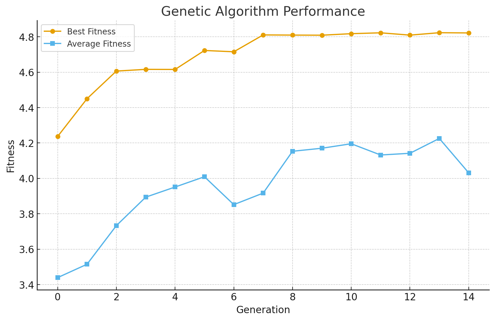

# IR Coursework — Group 22

Intelligent Robotics coursework implementing three progressive behaviour-based control tasks on the **e-puck robot** in the [Webots](https://cyberbotics.com/) simulator.

---

## Repository Structure
IR_Coursework_Group22/
├── Task1/                          # Task 1 – Line Following + Obstacle Avoidance
│   └── my_project/
│       ├── controllers/
│       │   └── bbr_line_avoid/
│       │       └── bbr_line_avoid.py
│       └── worlds/
│           └── Task1.wbt
│
├── Task2/                          # Task 2 – Phototaxis + Obstacle Avoidance
│   └── Task2/
│       ├── controllers/
│       │   ├── task2_controller/
│       │   │   └── task2_controller.py
│       │   └── supervisor_task2/
│       │       └── supervisor_task2.py
│       └── worlds/
│           └── task2.wbt
│
└── ir_task3/                       # Task 3 – Neuroevolution (GA + MLP)
└── SpeedWorld/
├── controllers/
│   ├── epuck_starter/
│   │   ├── epuck_starter.py
│   │   └── mlp.py
│   └── supervisorGA_starter/
│       ├── supervisorGA_starter.py
│       ├── ga.py
│       ├── Best.npy
│       └── fitness_convergence_plot.png.png
└── worlds/
└── Track.wbt
---

## Task Descriptions

### Task 1 — Line Following with Obstacle Avoidance

**File:** `Task1/my_project/controllers/bbr_line_avoid/bbr_line_avoid.py`

A behaviour-based controller (BBR) that navigates a black line on the arena floor while autonomously circumnavigating physical obstacles.

**Key design choices:**
- **Ground sensors (gs0–gs2):** Normalised [0, 1] to detect the black line. Dark readings indicate the robot is on the line.
- **Proximity sensors (ps0–ps7):** Normalised [0, 1] for obstacle detection. Front sensors (ps0, ps7) are grouped; side sensors (ps1–ps2, ps5–ps6) are used during avoidance.
- **Noise-robust front detection:** A confirmation counter (`FRONT_CONFIRM_STEPS = 3`) prevents false triggers from sensor noise.
- **Finite State Machine (FSM)** for obstacle avoidance with three states:
  - `NONE` — normal line following
  - `TURN_OUT` — arc away from the obstacle
  - `GO_AROUND` — side-follow the obstacle using an IR gap-control strategy
- **Heading estimation:** A lightweight wheel-speed integrator tracks approximate heading to avoid rejoining the line from the wrong direction after avoidance.
- **Sensor smoothing:** Inputs are averaged over 3 time steps before actuation.

---

### Task 2 — Phototaxis with Supervisor-Managed Light Switching

**Files:**
- `Task2/Task2/controllers/task2_controller/task2_controller.py` — robot controller
- `Task2/Task2/controllers/supervisor_task2/supervisor_task2.py` — supervisor

The robot navigates towards a randomly activated spotlight in the arena while avoiding obstacles. A separate Supervisor process monitors arrival and switches the active light.

**Robot controller:**
- **Priority 1 — Obstacle Avoidance:** Proximity sensors (ps0–ps7) trigger a reactive turn away from obstacles (threshold > 80 raw units).
- **Priority 2 — Phototaxis:** Light sensors (ls0–ls7) guide the robot towards the brightest source (lowest ls value). Front/right/left sectors drive forward, right-turn, or left-turn commands respectively. A spinning search behaviour activates in darkness (ls > 3500).

**Supervisor:**
- Tracks the robot's XZ position using the Webots Supervisor API.
- Toggles one of four `SpotLight` nodes on/off via the `on` field.
- Switches to a new random light (different from the current one) when the robot reaches within 0.20 m of the active light.

---

### Task 3 — Neuroevolution: Genetic Algorithm + MLP Speed Optimisation

**Files:**
- `ir_task3/SpeedWorld/controllers/supervisorGA_starter/supervisorGA_starter.py` — GA supervisor
- `ir_task3/SpeedWorld/controllers/supervisorGA_starter/ga.py` — genetic algorithm operators
- `ir_task3/SpeedWorld/controllers/epuck_starter/mlp.py` — multi-layer perceptron
- `ir_task3/SpeedWorld/controllers/epuck_starter/epuck_starter.py` — e-puck MLP controller
- `ir_task3/SpeedWorld/controllers/supervisorGA_starter/Best.npy` — saved best genotype

The e-puck's motor commands are produced by a **Multi-Layer Perceptron (MLP)** whose weights are evolved by a **Genetic Algorithm (GA)** to maximise lap speed on the SpeedWorld track.

**MLP (`mlp.py`):**
- Flexible architecture (configurable layer sizes).
- Tanh activation function (`sigmoid = tanh`).
- Bias unit automatically added to the input layer.
- Forward-pass used for inference at each time step.

**GA (`ga.py`):**
- Population: 18 individuals, 15 generations, 2 elites.
- **Selection:** Tournament selection (group size 5).
- **Crossover:** Single-point crossover at the genome midpoint.
- **Mutation:** Per-gene random perturbation at 30% rate, clipped to [−1, 1].
- **Elitism:** Top 2 individuals carried forward unchanged each generation.

**Supervisor (`supervisorGA_starter.py`):**
- Communicates weights to the robot via Webots Emitter/Receiver channel.
- Evaluates each individual for 90 seconds of simulation time.
- Logs per-generation best and average fitness to a timestamped CSV file.
- Plots real-time fitness curves (red = best, green = average) on the in-simulation Display.
- Saves the best genotype to `Best.npy` after each generation.
- Interactive keyboard interface: press **S** to run optimisation, **R** to replay the best individual.

---

## Requirements

- [Webots R2023b](https://cyberbotics.com/#download) or later
- Python 3.10+
- `numpy` (for Task 3)

Install numpy if needed:
```bash
pip install numpy
```

---

## Running the Simulations

### Task 1
1. Open Webots → `File > Open World` → `Task1/my_project/worlds/Task1.wbt`
2. Press **Play**. The e-puck will begin line following and avoid any obstacles it encounters.

### Task 2
1. Open Webots → `Task2/Task2/worlds/task2.wbt`
2. Press **Play**. The supervisor activates a random spotlight; the robot navigates towards it and the light switches on arrival.

### Task 3
1. Open Webots → `ir_task3/SpeedWorld/worlds/Track.wbt`
2. Press **Play** to start the simulation.
3. In the Webots console:
   - Press **S** to begin GA optimisation (runs 15 generations × 18 individuals × 90 s each).
   - Press **R** to replay the best evolved controller from `Best.npy`.

A pre-evolved `Best.npy` is included so you can press **R** immediately without running the full optimisation.

---

## Results (Task 3)

The fitness convergence plot below shows best (red) and average (green) fitness across 15 generations:



GA log data is saved to `GA_log_<timestamp>.csv` in the `supervisorGA_starter/` directory.

---

## Authors

**Group 22** — Heriot-Watt University
MSc Robotics — Intelligent Robotics Coursework
